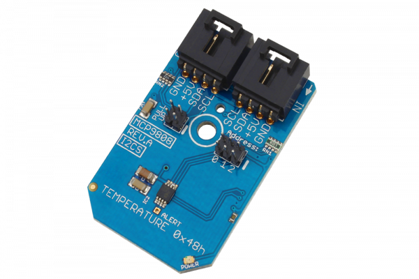

# MCP9808

The MCP9808 is perhaps one of the most accurate temperature sensors we have seen.This device offers an incredible ±0.25 of accuracy over an extended temperature range of -40°C to +125°C.
This Device is available from www.ncd.io 

[SKU: MCP9808_I2CS]

(https://store.ncd.io/product/mcp9808-maximum-accuracy-digital-temperature-sensor-%C2%B10-25-from-40c-to-125c-i2c-mini-module/)
This Sample code can be used with Arduino.

Hardware needed to interface MCP9808 sensor with Arduino

1. <a href="https://store.ncd.io/product/i2c-shield-for-arduino-nano/">Arduino Nano</a>

2. <a href="https://store.ncd.io/product/i2c-shield-for-arduino-micro-with-i2c-expansion-port/">Arduino Micro</a>

3. <a href="https://store.ncd.io/product/i2c-shield-for-arduino-uno/">Arduino uno</a>

4. <a href="https://store.ncd.io/product/dual-i2c-shield-for-arduino-due-with-modular-communications-interface/">Arduino Due</a>

5. <a href="https://store.ncd.io/product/mcp9808-maximum-accuracy-digital-temperature-sensor-%C2%B10-25-from-40c-to-125c-i2c-mini-module/">MCP9808 Temperature Sensor</a>

6. <a href="https://store.ncd.io/product/i%C2%B2c-cable/">I2C Cable</a>

MCP9808:

The MCP9808 is perhaps one of the most accurate temperature sensors we have seen.This device offers an incredible ±0.25 of accuracy over an extended temperature range of -40°C to +125°C.

Applications:

• Industrial freezers and refrigerators

• Food processing

• Personal computers and servers

• Consumer electronics and

• Handheld/portable devices

How to Use the MCP9808 Arduino Library

The MCP9808 has a number of settings, which can be configured based on user requirements.
          
1.Limit Hysterisis setting:The following command is used to set the hysterisis limit of temperature.

             mcp.setTHyst(THYST_0C);         // 0°C (power-up default)
            
2.Shut down mode:The following command is used to set in continuous conversion mode.

             mcp.setTShdn(SHDN_CONT);        // Continuous conversion (power-up default)
             
3.Resolution settings:The following command is used to set the resolution of temperature sensor.            
             
             mcp.setRes(RES_0_0625);         // +0.0625°C (power-up default, tCONV = 250 ms typical)
